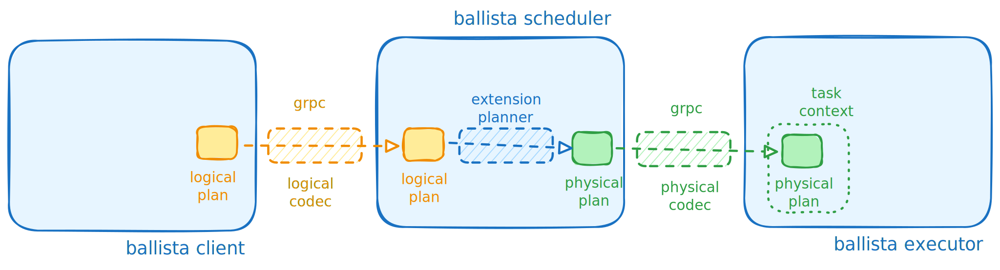

# Ballista Extensions

This project introduces additional features and custom extensions for the [Ballista distributed compute platform](https://github.com/apache/arrow-ballista). The goal is to enhance Ballista's capabilities by providing new logical and physical operators, utilities, and integration tools to support advanced data processing workflows.

This example will implement `sample()` method which will return a sampled subset of original `DataFrame`:

```rust
let ctx = SessionContext::remote_with_state("df://localhost:50050", state).await?;
let df = ctx.read_parquet("data/", Default::default()).await?;

// The `sample` operator, defined in this project,
// samples 30% of the data and displays the result.
let df = df.sample(0.30, None)?;
```

To implement this functionality, it is necessary to implement new logical and physical plan operators.

>
> [!WARNING]  
> Please do not use implemented sampling operator for production, probably statisticians would not approve.
>

This project outlines the steps required to implement this functionality and integrate it with Ballista:

- Custom DataFusion (logical and physical) nodes.
- Logical and physical extension codecs.
- Custom protocol buffer definitions.
- Extension query planner.

## Logical Plan Extension

The first step is to implement a custom [logical plan extension](src/logical/sample_extension.rs):

```rust
#[derive(Debug, Clone, PartialEq, PartialOrd)]
pub struct Sample {
    pub fraction: f32,
    pub seed: Option<i64>,
    pub input: LogicalPlan,
}

impl UserDefinedLogicalNodeCore for Sample {
    fn name(&self) -> &str {
        "Sample"
    }
    // Additional implementation omitted for brevity
}
```

## DataFrame Extension

To expose this functionality to end users, a [DataFrame extension](src/dataframe/sample.rs) is implemented. This extension creates a `LogicalPlan::Extension(extension)` node:

```rust
pub trait DataFrameExt {
    fn sample(self, fraction: f32, seed: Option<i64>) -> datafusion::error::Result<DataFrame>;
}

impl DataFrameExt for DataFrame {
    fn sample(self, fraction: f32, seed: Option<i64>) -> datafusion::error::Result<DataFrame> {
        if !(fraction > 0.0 && fraction <= 1.0) {
            Err(DataFusionError::Configuration(
                "fraction should be in 0 ..= 1 range".to_string(),
            ))?
        }

        let (state, input) = self.into_parts();

        let node = Arc::new(Sample {
            fraction,
            seed,
            input,
        });
        let extension = Extension { node };
        let plan = LogicalPlan::Extension(extension);

        Ok(DataFrame::new(state, plan))
    }
}
```

This approach enables the addition of new methods to the DataFusion DataFrame implementation:

```rust
let ctx = SessionContext::remote_with_state("df://localhost:50050", state).await?;
let df = ctx.read_parquet("data/", Default::default()).await?;

// The DataFrame extension provides the `sample` method
let df = df.sample(0.30, None)?;
```



## Logical Extension Codec

With the extension in place, a custom logical extension codec is required to transmit the client logical plan to the scheduler.

The logical extension codec typically consists of two components: Google Protocol Buffer definitions:

```proto
message LMessage {
    oneof Extension {
        LSample sample = 1; 
    }
}

message LSample {
    float fraction = 1;
    optional int64 seed = 2;
}
```

See [proto/extension.proto](proto/extension.proto).

and an implementation in [Rust code](src/codec/extension.rs) of the `LogicalExtensionCodec` trait, which handles conversion between Rust structures and protocol buffer definitions.

## Logical to Physical Plan Translation

Once the logical plan extension is provided, a translation from the logical node to a physical node is required. The transformation is performed using implementing `ExtensionPlanner` trait:

```rust
#[derive(Debug, Clone, Default)]
pub struct CustomPlannerExtension {}

#[async_trait]
impl ExtensionPlanner for CustomPlannerExtension {
    async fn plan_extension(
        &self,
        _planner: &dyn PhysicalPlanner,
        node: &dyn UserDefinedLogicalNode,
        _logical_inputs: &[&LogicalPlan],
        physical_inputs: &[Arc<dyn ExecutionPlan>],
        _session_state: &SessionState,
    ) -> datafusion::error::Result<Option<Arc<dyn ExecutionPlan>>> {
        if let Some(Sample { fraction, seed, .. }) = node.as_any().downcast_ref::<Sample>() {
            let input = physical_inputs
                .first()
                .ok_or(DataFusionError::Plan("expected single input".to_string()))?
                .clone();
            let node = SampleExec::new(*fraction, *seed, input);
            let node = Arc::new(node);

            Ok(Some(node))
        } else {
            Ok(None)
        }
    }
}
```

The [custom planner](src/planner/custom_planner.rs) is registered in the session state as follows:

```rust
let query_planner = Arc::new(QueryPlannerWithExtensions::default());

let state = SessionStateBuilder::new()
    .with_query_planner(query_planner)
    .with_default_features()
    .build();
```

Finally, the generated physical plan is serialized using the [physical plan codec](src/codec/extension.rs) and transmitted to the executor(s).
